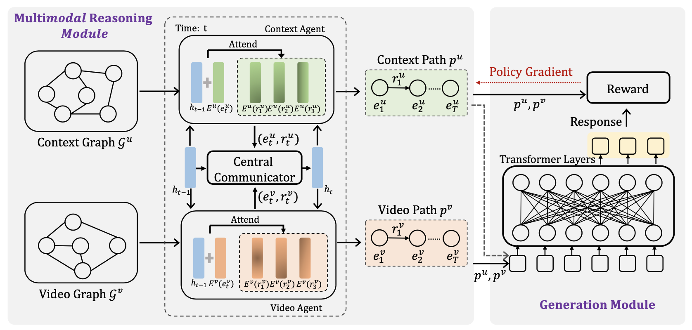

# Collaborative Reasoning on Multi-Modal Semantic Graphs for Video-Grounded Dialogue Generation

This is the official code for the paper [Collaborative Reasoning on Multi-Modal Semantic Graphs for Video-Grounded Dialogue Generation](https://arxiv.org/abs/2210.12460) (EMNLP 2022 Findings)

## Overview



we first propose extracting pertinent information from videos and turning it into reasoning paths that are acceptable to PLMs. Additionally, we propose a multi-agent reinforcement learning method to collaboratively perform reasoning on different modalities (i.e., video and dialogue context)

## Installation

```
pip install requirements.txt
```

## Data Preparation

*We will maintain the code for creating the multi-modal semantic graph, but you can reproduce it following the details in the paper.*

- Download [DSTC7-AVSD](https://github.com/hudaAlamri/DSTC7-Audio-Visual-Scene-Aware-Dialog-AVSD-Challenge)
- Download [Twitch-FIFA](https://github.com/ramakanth-pasunuru/video-dialogue)
- Install [word2vec](https://code.google.com/archive/p/word2vec/)
- Install Coreference Resolution tools: [AllenNLP](https://github.com/allenai/allennlp-models) | [Huggingface](https://github.com/huggingface/neuralcoref) | [references](https://github.com/NeuroSYS-pl/coreference-resolution) | [ChatGPT](https://chat.openai.com/)
- Install open IE tools: [OPENIE 5.1](https://github.com/dair-iitd/OpenIE-standalone) | [OPENIE6](https://github.com/dair-iitd/openie6) | [Stanford OpenIE](https://nlp.stanford.edu/software/openie.html) | [ChatGPT](https://chat.openai.com/)
- Install video action extraction tools: [PytorchVideo](https://pytorchvideo.org/) | [SLOWFAST](https://github.com/facebookresearch/SlowFast)
- The data structure should look like the following (default)

```
data/
├── avsd/ # avsd dataset
    ├── vggish
    ├── i3d_flow
    ├── i3d_rgb
    ├── train.json
    ├── val.json
    └── test.json
├── mm-graph/semantic_graph/ # multi-modal semantic graph
    ├── avsd_context/traj.json
    ├── avsd_caption/traj.json
    └── avsd_video/traj.json

```

## MARL_SG

*It is worth noting that we add the implementation of random reward ([Discovering Diverse Multi-Agent Strategic Behavior via Reward Randomization](https://arxiv.org/abs/2103.04564)) and simulated annealing ([Generating Informative Dialogue Responses with Keywords-Guided Networks](https://arxiv.org/abs/2007.01652)) in this version of code for further study.*

### Train

```
python marl_vt_train_rr.py \
	--train_path data/avsd/train.json \
	--valid_path data/avsd/valid.json \
	--fea_path data/avsd/ \
	--context_traj_path data/mm-graph/semantic_graph/avsd_context/traj.json \
	--caption_traj_path data/mm-graph/semantic_graph/avsd_caption/traj.json \
	--video_traj_path data/mm-graph/semantic_graph/avsd_video/traj.json \
	--train_batch_size 4 \
	--valid_batch_size 4 \
```

### Test

```
python marl_vt_generate.py \
	--test_set data/avsd/test.json \
	--context_traj_path data/mm-graph/semantic_graph/avsd_context/traj.json \
	--caption_traj_path data/mm-graph/semantic_graph/avsd_caption/traj.json \
	--video_traj_path data/mm-graph/semantic_graph/avsd_video/traj.json \
	--beam_size 5 \
	--max_length 18 \
	--min_length 1 \
	--penalty 0.4 \
	--ckptid SELECTED_CKPT
```
